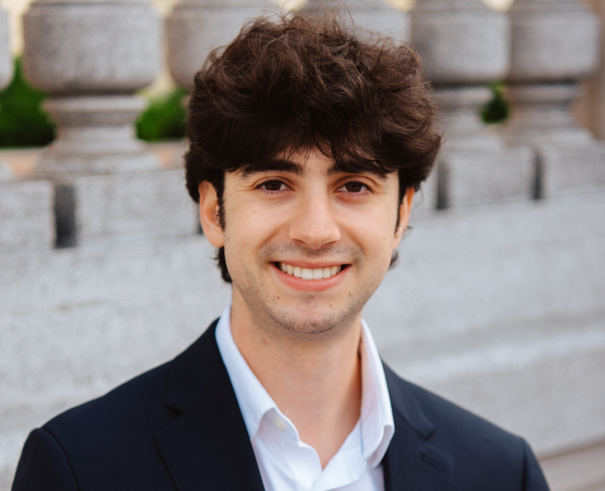

# Johnny Mudawar

# About Me
Hi! I'm Johnny Mudawar. I build backend systems, AI applications, and tools that make complex workflows simpler. I recently graduated from UC Berkeley with degrees in Data Science and Microbial Biology, and most recently worked at Twist Bioscience, where I helped build software services powering DNA manufacturing. I'm fascinated by the intersection of AI, software engineering, and biology, and I'm focused on applying AI to solve real world problems.
